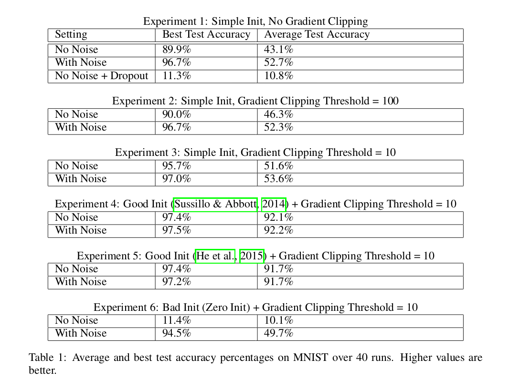

## Adding gradient noise improves learning for very deep networks

### Summary
In this paper, authors explore a simple technique of adding annealed Gaussian noise to the gradient, which is found to be surprisingly effective in training deep nerual networks with stochastic gradient descent. This addition of noise lowers training loss by encouraging active exploration of the parameter space. This exploration proves especially necessary and fruitful when optimizing neural network models containing manylayers or complex latent structures.

### Method
Add time-dependent Gaussian noise to the gradient g at every training step t:

$$g_t \leftarrow g_t + N(0,\sigma_t^2)$$

The experiments indicate that adding annealed Gaussian noise by decaying the variance works better than using fixed Gaussian noise. The schedule (inspired from the Welling Langevin Dynamics paper) for most of the experiments takes the form of:
$$ \sigma_t^2 = \frac{\eta}{(1+t)^\gamma}$$
with \\( \eta\\) selected from 0.01, 0.3, 1.0 and \\(\gamma = 0.55\\). Higher gradient noise at the beginning of training forces the gradient away from 0 in the early stages.

### Experiments
Authors find that when using a simple init (Normal with mean 0 and variance of 0.1) adding gaussian noise improves performance. However, when using the He initialization, the addition of noise does not help. To further test, authors also initialize weights of network at 0, and find that adding gradient noise improves substantially.

 

They show that by using carefully tuned gradient clipping and initialization schemas, adding gradient noise is not necessary. However, with poor initialization, gradient noise helps tremendously. So, it should be good to add gradient noise to more complex networks (since they are even harder to initialize). Authors also find that training with gradient noise is insensitive to the gradient clipping values. By tuning the gradient clipping threshold, it is possible to get comparable accuracy without noise for this problem. 
For **Neural Programmer and Neural Random Access Machines**, gradient clipping is crucial to training with added noise. This is likely because the effect of random noise is washed away when gradients become too large. 

For **Memory Networks** the noise is added after gradient clipping. Value of noise is finetuned at 0.001. 

### Conclusion
Authors show effectiveness of adding noise to complex neural networks, It improves training and generalization. They also suspect the effects are pronounced for complex models because they have many local minima.
However, no formal analysis as to why this works is offered.