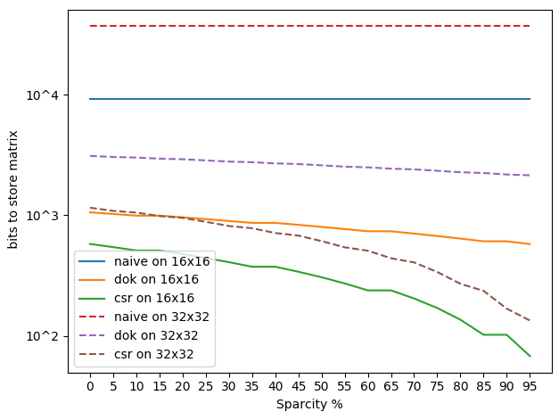

# Sparse Matrix Storing

[wikipedia](https://en.wikipedia.org/wiki/Sparse_matrix) 

In the case of a sparse matrix, substantial memory requirement reductions can be realized by storing only the non-zero entries. Depending on the number and distribution of the non-zero entries, different data structures can be used and yield huge savings in memory when compared to the basic approach. The trade-off is that accessing the individual elements becomes more complex and additional structures are needed to be able to recover the original matrix unambiguously.

Formats can be divided into two groups:

- Those that support efficient modification, such as DOK (Dictionary of keys), LIL (List of lists), or COO (Coordinate list). These are typically used to construct the matrices.
- Those that support efficient access and matrix operations, such as CSR (Compressed Sparse Row) or CSC (Compressed Sparse Column).

**Contains:
 - DOK
 - CSR
 - CSC**
 
## Methods
 
**Note**:
 -  assume all matrix entries are 32bit floats by default.
 -  zero entries are denoted with *z*
 - nonzero with \\(\neg z \\)
### Naive approach (LIL or COO)

Store a 2d array of all values (LIL): 

$$32bit * (m \times n)$$

Or a list of tuples wit (row, column, value) (COO):

$$ (32bit + 2bit + 2bit) * (m \times n)$$

> These formats are better for quick reconstruction instead, rather than strorage or matrix-operations; which we are interested in

### Dictionary of Keys (DOK)

Dictionary maps key-tuples to values:

$$M_{i,j} \rightarrow \text{ value}$$

 Keys can be stored with lower bits so you get:
 $$ (m \times n)*2bit + 32bit * (1+ \neg z)$$
 
 If  \\(\neg z \\) is low enough, i.e. your matrix is sparse, this makes sense.

### Compressed Sparse Row (CSR)

Represent the matrix as 3 arrays (\\(A,\ I_A\ J_A\\))  in 1D:

1. Contains all nonzero elements (\\(A \in R^{\neg z}\\)) in *'row-major'* order
2. More difficult, of length *m+1*, 
	- First element is 0
	- Last element is equel to \\(\neg z\\)
	- In between (*i*) is previous element + non-zero elements on previous row *i-1*. It therefore stores where one would start reconstructing the matrix.
3. Contains column index of all elements in A (\\(J_A \in R^{\neg z}\\))

In total this gives us :

$$ \neg z * (2bit + 32bit) + 2bit * (m + 1)$$

### Compressed Sparse Column (CSC)

Same as CSR but then colums and rows are swapped. (transposed)

## Conclusion

**it makes a hell of a lot of difference**
 

