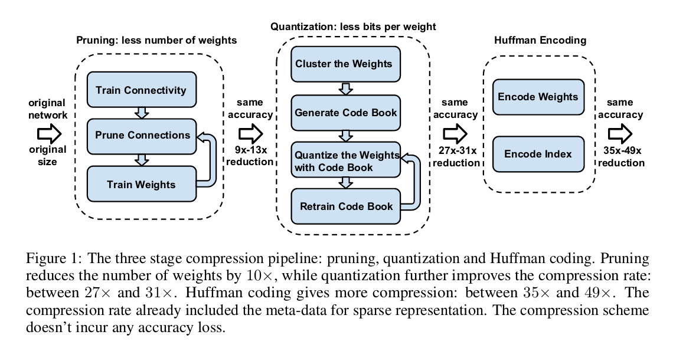
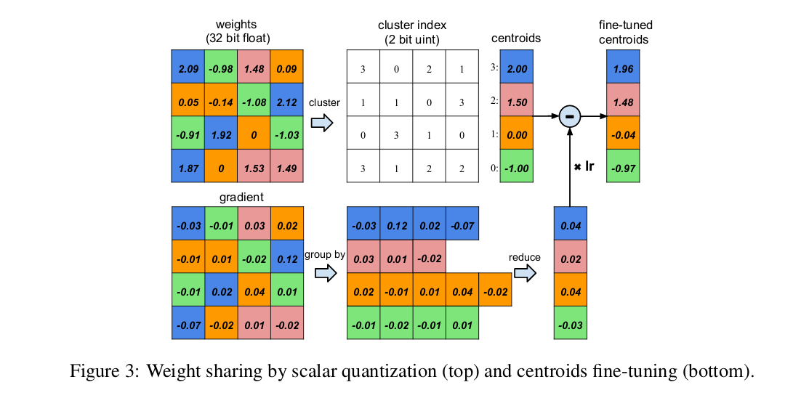

### Deep Compression : Pruning, trained quantization and Huffman coding
This paper is focused more on compressing storage size rather than speedup offered by pruning. ***Very popular though***

Authors introduce a 3 stage pipeline for compression:

- Pruning (= entire pipeline of [han et al 2015](./Learning both Weights and Connections for EfficientNeural Networks (han et al (NVIDIA), 2015).md) )
- Quantization
- Huffman coding

 

The details of each of these steps can be found below.
#### Network Pruning

[See han et al 2015](./Learning both Weights and Connections for EfficientNeural Networks (han et al (NVIDIA), 2015).md) 

Network pruning is done based on iterative magnitude pruning. The sparse structures that result from this are stored using compressed sparse row (CSR) or compressed sparse column (CSC) format. **(todo: look into how those work)**. It achieves compression rates of ~10x.

For further compression, only the index difference is stored, instead of absolute position. (8 bits for conv layer, 5 bits for FC layer, more details in the paper). **\\(\leftarrow\\)????**

#### Trained Quantizatoin and Weight Sharing

Network quantization and weight sharing further compresses the pruned network by reducing the number of bits required to represent each weight. We limit the number of effective weights we need tostore by having multiple connections share the same weight, and then fine-tune those shared weights

The quantizatoin + weight sharing scheme authors use is summarised in the figure below. 

1. Group weights in 4 bins, which share the same weight and thus need only an index repsesentation (2bit) pointing to the centroid float values.
2. Gradient updates are also shared (summed), see bottom row
3. Finetune with weight sharing
4. Steps could be repeated as well.

 
By doing this, only the index of the bin for each weight can be stored. During update, all gradients from the same bin are collected and summed. This gradient is used to fine-tune the coordinate of the centroid. 

To find the centroids, authors use k-means clustering, minimising intra-cluster sum-of-squares:
$$arg\,min_c \sum_{i=1}^k \sum_{w \in c_i} |w - c_i|^2$$,
where c is the set of centroids of size k, and W are the weights.

The initialization of shared weights affects the quality of the network's prediction. Best initialization strategy was linear (other two were Forgy random and density-based). This is because Forgy and density-based do not give enough representation to the large weights (which are rarer than the small ones, and play a more important role in network performance). 

During feed-forward and backprop, table lookup is required to access each weight. The gradient of the centroids can be calculated by:
$$ \frac{\partial L}{\partial C_k}=\sum_{i,j} \frac{\partial L}{\partial W_{ij}}\frac{\partial W_{ij}}{\partial C_k}=\sum_{i,j}\frac{\partial L}{\partial W_{ij}} \mathbf{1}(\mathbf{I}_{ij}=k)$$ 

#### Huffman Coding

A Huffman code is an optimal prefix code commonly used for lossless data compression. It uses variable-length codewords to encode source symbols. The table is derived from the occurrence probability for each symbol. More common symbols are represented with fewer bits. Huffman coding the distributions of quantized weights and sparse matrix indices saves 20-30% of network storage.

#### Experiments

Up to 35x to 49x on across different networks without loss of performance. For more details check out the paper, section 5. (too many experiments to write in a summary)

#### Discussion

- Pruning and quantization work very well together
- Initialization of the centroids should be done such that large weights can form a large centroid. (e.g. linear initialization).
- This pipeline achieves massive speedup and energy savings across architectures and hardware (section 6.3)
- Weights and indices storage requirements are roughly equal, while storage required for the Huffman codebook is negligible