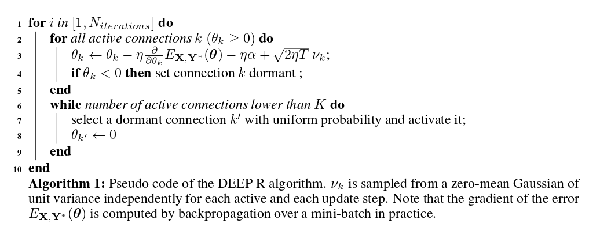
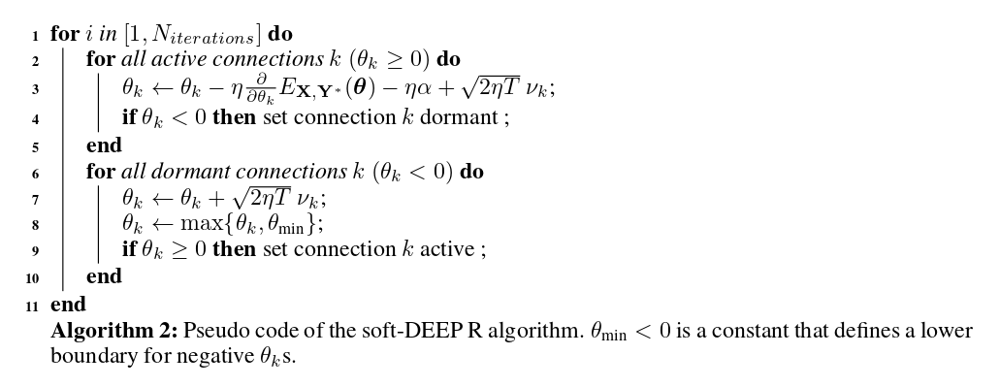

## Deep Rewiring

### Method Summary
- Start out with sparse network
- When a connection goes through 0 (flips sign), it is pruned, and a randomly drawn other connection is tried out by the algorithm
- DeepR gradient descent is combined with a random walk in parameter space (Wellig Paper, Bayesian learning via stochastic gradient langevin dynamics)
- This allows Deep R to jointly sample network weights and the network architecture from the posterior distribution (the dist. that combines the data likelihood and a specific connectivity prior) in a Bayes optimal manner
### DeepR Method
Each weight is defined as  \\(w_k = s_k \theta_k \\), where \\(s_k\\) is a constant sign \\(in {-1,+1}\\). If \\(\theta_k\\) is negative, we say that the connection \\(w_k\\) is dormant, i.e. it is equal to 0. If it is positive, it represents the magnitude of that connection. 

The pseudocode for the DeepR algorithm is found below:

 

where, in line 3, second term is the error term as usual, the third term is L1 regularziation (although other regularizers can be used) and the last term is a noise term, with \\(v_k\\) being sampled from \\(\mathcal{N}(0,1)\\) and T, the temperature paramter, controls the amount of noise added to the update. **This last term implements a random walk over the parameter space. **  The rewiring aspect is captured in line 4 and lines 6-9. For each connection that was pruned, we sample a new connection from the inactive ones and initialize it at 0.
The rewiring strategy ensures that at each time step, a maximum of K connections are active.

On MNIST can maintain accuracy up to around 98% sparsity. For CIFAR10, this drops to 80%, after which there is some performance degradation (86% to 81% at 98% sparsity).

### Convergence properties of Deep R and soft-Deep R
Authors introduce soft-DeepR, whose theoretical treatment of convergence is more straightforward. It is defined below:
 
The updates for the active connections are the same (line 3) as well as the mapping from \\(\theta_k\\) to \\(w_k\\). The main difference is that the connection parameters continue their random walk even when dormant. Because of this random walk, connections will be re-activated at random times when they cross 0. Authors go on to prove the convergence properties of DEEP R and soft-DEEP R, justifying how they arrive at the formulas in the algorithm. (check paper section 4 for this. Don't quite understand it atm, don't think it's super important tho).
> In essence, Deep R solves a constrained optimization problem by sampling parameter vectors \\(\theta\\) with high performance within the space of constrained connectivities. The algorithm will therefore spend most time in network configurations where the connectivity supports the desired network function, such that, connections with large support under the objective function will be maintained active with high probability, while other connections are randomly tested and discarded if found not useful.

### Limitations
- Only compare to Han et al's pruning method and L1 shrinkage. Not sure if they are state-of-the-art, even at the time of writing the paper
- Pruning signs that pass through 0 are pruned due to inspiration from neurobiology