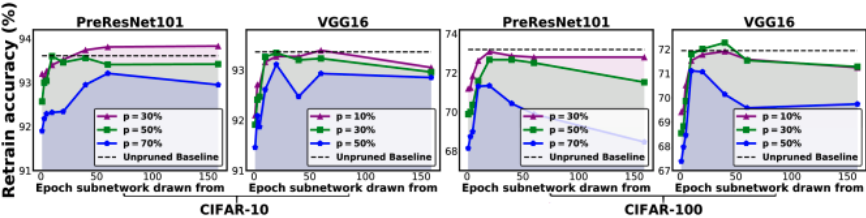
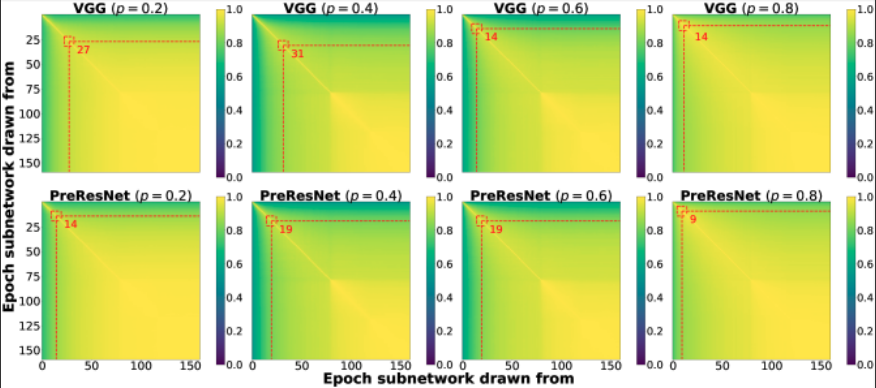

## Drawing Early-bird Tickets : Towards more efficient training of Deep Networks

### Some notes first
This paper uses structured filter pruning, as per [Liu et al, 2019](https://arxiv.org/abs/1708.06519) in the proposed EB train algorithm. It does not use rewind to later iteration (possible research direction) and also pruning is not done iteratively.

### Summary
- Authors discover existence of EB tickets: winning tickets that can be identified at the very early training stage
- A mask distance is proposed, based on Hamming distance, in order to indicate when to draw these tickets
- An algorithm for finding and training these EB tickets is proposed, offering great training speedup and energy savings (up to 4.7x energy savings) while maintaing or even surpassing accuracy when compared to original winning tickets

### Motivations
It has been observed that the early stage of training seems to first discover the important connections and connectivity patterns between layers, which later in training become relatively fixed. [Achille, 2018](https://arxiv.org/abs/1711.08856) 
It has also been observed that large initial learning rates help the model focus on memorizing easier-to-fit, more generalizable patterns faster and better. [Li, 2019](https://arxiv.org/abs/1907.04595)

### Experiments
#### Do EB tickets always exist?
Same idea as in the Lottery Ticket Hypothesis, however tickets are extracted much earlier during training. Results of the epoch the subnetwork is drawn from can be seen in figure below, with p indicating the channel pruning ratio.

Interestingly, there consistently exist winning tickets which outperform those drawn in later stages. Also, some EB tickets outperform the unpruned, fully-trained model, potentially thanks to the sparse regularization learned by EB tickets.

#### Do EB tickets still emerge under low-cost training?
Low-cost training = large learning rates + quantization (8-bit)
Yes. In fact, large learning rates favor the emergence of EB tickets. It has already been shown that larger learning rates are beneficial for training the dense model fully to draw the winning tickets [original LTH paper, rethinking the value of sparsity in nn's]; this benefit also extends to EB tickets.
EB tickets are not destroyed by low-precision training. In fact, emergence of EB tickets happens even earlier.

#### How to identify EB tickets practically?
*Mask Distance.* For each time of pruning, a binary mask of the drawn ticket is defined w.r.t. the full dense network. Pruned channels are denoted as 0, kept channels as 1; thus any network can be mapped into a binary *ticket mask*. For any two sub-networks pruned from the same dense model, their *mask distance* is the Hemming distance between their two ticket masks.
*Detecting EB tickets via mask distance.* A visualisation of the behavior of mask distances between networks drawn from consecutive epochs can be seen below, where (i,j) is the mask distance between a network drawn at epoch i and network drawn at epoch j.

Failry consistent behavior observed: 
- In the beginning, mask distances change rapidly between epochs, manifested by quickly "cooling colors". 
- After 10 epochs or so, off-diagonal elements also become "yellow", and the color transition becomes much smoother from diagonal to off-diagonal, indicating the masks change only very mildly after passing this point.
- After 80 epochs, the mask distances almost see no change across epochs.

It does seem to concur the hypothesis that a network first learns important connectivity patterns and then fixes them.
Since ticket masks quickly become stable and hardly change after early training, drawing EB tickets makes sense.

Therefore, to identify when to extract EB ticket, measure mask distance between consecutive epochs. Draw EB ticket when distance (normalized between 0 and 1) lower than a threshold epsilon. In practice, authors extract EB ticket only if past 5 epochs are lower than threshold eps to avoid irregular fluctuation in early training.

### EB training
Literally draw an EB ticket according to the criterion mentioned couple lines above, reset it to its initial weights, and then fine-tune it. That's all.
It compares favorably to other SOTA pruning methods such as Lottery Ticket, SNIP, Network Slimming and ThiNet, in terms of FLOPs and energy consumption. (which easily translates to speed) (see paper for more details)

### Potential research directions (Andrei)
Use iterative magnitude pruning to attain higher sparsity. See if rewinding to a later iteration helps (authors rewind all the way back to 0).
Are there other ways to facilitate the uncovery of early-bird tickets besides large learning rate?
