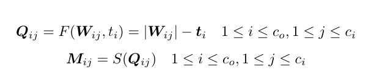
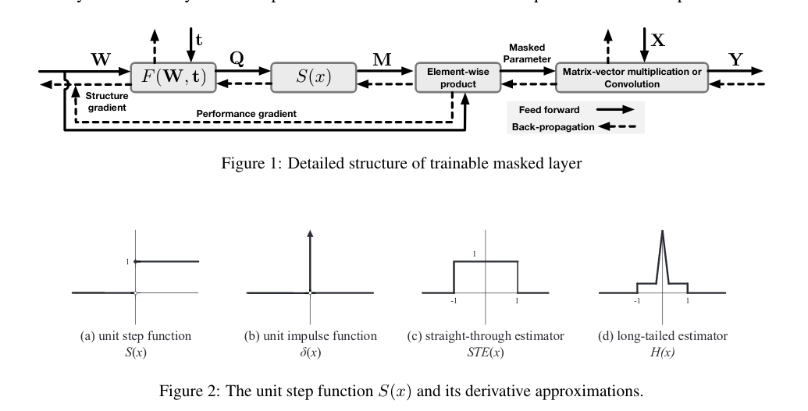
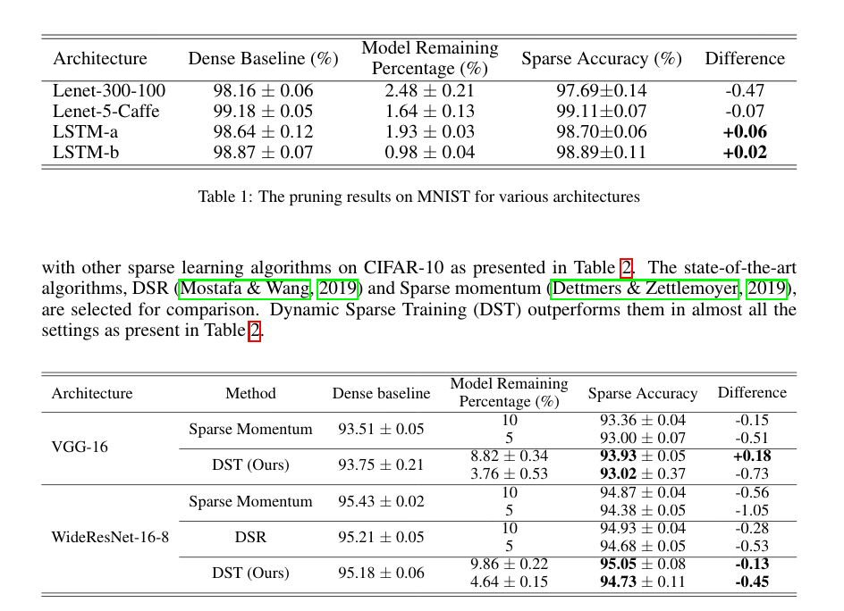

## Dynamic Sparse Training

Authors use a learnable threshold in order to prune network weights.
The masks are determined by a threshold which is shared per-neruon/filter, i.e. if weight-threshold is less than 0 then prune. 

Summarised as a formula, we get:
 

The derivative of the unit step function is 0 almost everywhere and infinite at 0 (i.e. a unit impulse function). Due to this, we cannot apply it to backpropagation directly. However, we can use an estimator to estimate this derivative. We could, for instance, use the straight-through estimator or the long-tailed estimator to approximate that derivative. Authors use the long-tailed estimator in their work.
And this is the resulting computation graph as well as a figure of the step function, its derivative, and possible estimators one could use:
 

Now since the threshold is trainable, we want high sparsity. As such, we can impose a regularization term on the threshold variable such that it becomes larger. As such, the regularization term used in the paper is:
\\(R=sum_{i=1}^{c_0} \exp (-t_i) \\), with \\(c_0\\) the num of output units and \\(t\\) is a \\(c_o\\) dimensional vector, and \\(i\\) indexes the i-th element of that vector. This function is chosen as a regularization since it goes to zero asymptotically. Therefore, it penalizes low thresholds without encouraging them to become extremely large.

Results are rather good. High sparsity with no loss in performance.
Below are tables for some architectures on MNIST and CIFAR10. Weirdly, they use an LSTM for MNIST.
 