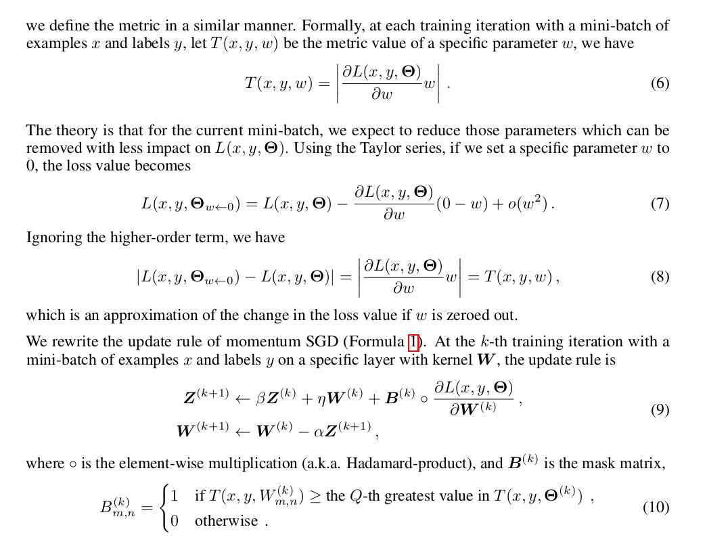

### Global sparse momentum SGD for pruning very deep neural networks

#### Summary
- Given a global compression ratio, parameters are categorized into two parts at every training update
- Important parameters receive the normal SGD update (active update)
- Parameters deemed unimportant are updated using only weight decay (i.e. \\(L_2\\) regularization) (passive update)
- This ensures that redundant parameters get close to zero, making the network robust to pruning those parameters
- First-order Taylor series is used to estimate the importance of parameters

#### Sparse gradient flow
 

Equation (10) basically means that for the weights whose metric are not in the top-Q of that respective update, they're only updated using the weight decay, and not their actual gradient.

**GSM allows for implicit reactivation and fast continous reduction. ** Since the activation selection is conducted at every iteration, the penalized connections can be reactivated if they're now considered important to the network. 

Since it would be nice to know how many passive updates k are needed for a parameter w to be small enough for it to be pruned with no effect on the loss function, the standard SGD formula is used. However, it is quite cumbersome, so for common use cases, authors use an empirical formula which is precise enough to approximate the resulting value. (more details in the paper)

GSM shown to find better winning tickets. Two possible explanations are that GSM can find the unimportant parameters by activation selection much earlier than the magnitude-based criterion, and GSM decides the final winning tickets in a way that is robust to mistakes (due to activation re-selection). 