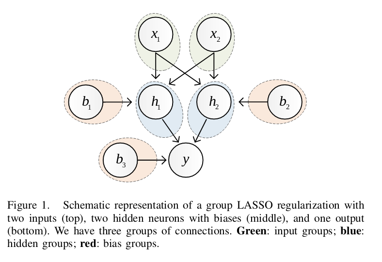

## Group Sparse Regularization for Deep Neural Networks

### Summary
Authors extend group lasso to impose structured sparsity on the network, where each group is defined as the set of outgoing wegiths from a neuron. This way you can do (1) feature selection (removing input neurons), (2) pruning (removing internal neurons) and (3) bias selection (when removing a bias unit).

### Method
Authors define 3 groups of variables: input groups, bias groups and hidden groups. Lasso reg. is applied group-wise, forcing all connections of a group to be either all simultaneously 0 or not. (i.e. pruning that neuron). Bias groups contain only 1 bias neuron.
 

Denote the collection of all groups as \\( \mathcal{G} = \mathcal{G}_{in} \cup \mathcal{G}_h \cup \mathcal{G}_b \\). Group sparse regularization can be rewritten as:

$$ R_{l_{2,1}}(\textbf{w}) = \sum_{g \in \mathcal{G}} \sqrt{|\textbf{g}|} \|g\|_2 $$

where \\( |g|\\) is the dimensionality of the vector g, and ensures that each groups gets weighed uniformly. L 2,1 symbol is used because formulation is close to the L2,1 norm in matrices.

Using this, we can define Sparse Group Lasso (SGL):
$$ R_{SGL}(\textbf{w}) = R_{l_{2,1}}\textbf(w) + R_{l_1}(\textbf{w})$$
The procedure is to train the network with this regularization term incorporated into the loss, and then threshold groups based on their \\( R_{l_{2,1}}\\) penalty and individual neurons based on their \\(R_{l_1}\\) penalty. This results in a densely structured sparse network.

Can prune around 70-80% of neurons in the hidden layers, while incurring low to negligible loss in accuracy. Can also be implemented with little to no (computational-)overhead.
### Caveats
Results are not that impressive. Tested only on very small datasets (MNIST-like) and small networks. 