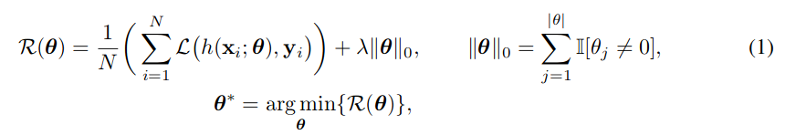
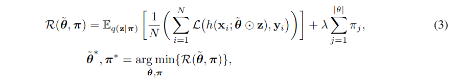
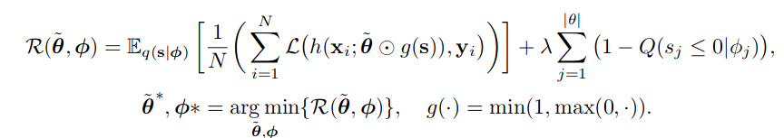
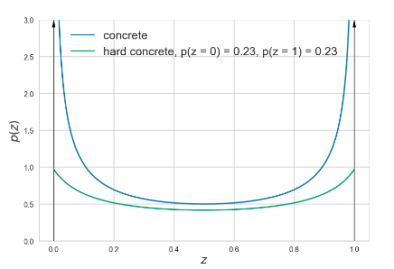
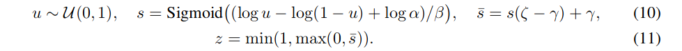
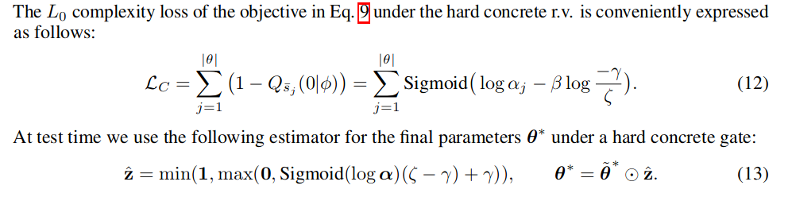

# Learning Sparse Neural Networks Through L0 Regularization
[Link to paper](https://arxiv.org/pdf/1712.01312.pdf)

A practical method for L0-norm regularization for neural networks. 
AIC and BIC, well-known model selection criteria, are special cases of L0-regularization.

## Related Work

says weight pruning is inferior to neuron pruning. But all these require training the network, unlike their method (*which is alo weight-pruning*). 

## Derivations

**Problem:** L-0 is non differentiable
**Solution:** Inclusion of a collection of non-negative stochastic gates, which collectively determine which weights to set to zero. i.e. Smoothing the binary L0-norm with continous distributions to maintain differentiability but also maintain its behaviour. For this purpose they employ a hard-sigmoid and the hard-concrete

> Just a thought by Stijn on getting l0 norm: *couldn't you squeeze out all parameters that are 0, and then just take the shape of the remainder. Or devide by itself to get al 1's, and then sum up??*

### Hard-concrete:

It is obtained by “stretching” a binary concrete random variable (*see sources in paper, end of intro*) and then passing its samples through a hard-sigmoid. As a substitute of l0-norm, it does not induce shrinkage of params (like l-1), only deletion. 

#### Derivation of derivable l0 norm:

1. Reparametrize each param j to be: 
$$\theta_j=z_j \tilde{\theta_j}$$ 

2. Define a Bernoulli overt \\(z_j=q(z_j|\pi_j)\\), thereby defining it as a binary gate

3. Define \\(\theta_j \neq 0\\), as \\(z_j\)) is managing the going to zero already.

4. 
	- Reformulize original optimisation:
	
	 - To:
	
	 - Wow we see l0 norm replaced by the parameters that govern the bernoullis. This is related to Variational Inference.
5. 
	Now the regularization is differentiable. 
	- However, the first term is now difficult due to the discrete nature of **z**. 
	- REINFORCE is an option, but high variance
	- Straight-Through-Estimator is an option, but biased
	- The concrete distribution is an option, but doesn't allow parameters \\(z=q(z|\pi)\\) to be exactly zero. **Still they go with this one**
	
6. Define a new random variable **s** to migitate this problem: \\(s\sim q(s|\phi)\\).
7. Redefine **z** to be  a hard sigmoid so that it can be exactly 0: \\(z=min(1, max(0, s))\\)
8. Define a active gate as the CDF of Q:  \\(q(z \neq 0 | \phi) = 1 - q(z \leq 0 | \phi)  \\)
so 1 - chance that **s** is non-positive. Because if **s** is that, **z** will be 0, whilst if s is positive, then **z** will be either s or 1. Therefore we get a range between 0 and 1. sort of like a hard sigmoid, which is like a linear version of the sigmoid or a relu with a limit.

9. Now we can redefine the optimisation again, just like in step 4. to:
	 
	
10. If we make sure the distribution q is continuous, we can use the Reperametrization-trick, and replace \\(E_{s \sim q(s|\phi)}\\) with \\(E_{p(\epsilon)}\\) in the formulas of step 9. Now we can do MC approximation.

#### On to hard-concrete distributions

Now we need to choose a appropiate **q(s)** distribution. 

1. Assume rand-var **s** to be binary concrete distribution between 0 and 1. 
	-  This distribution is a "A Continuous Relaxation of Discrete Random Variables" that allows a Discrete Random variable to reparametrized for backpropagation.
	- Given by PDF: \\(q(s|\phi)\\) and CDF: \\(Q(s|\phi)\\)
	- With params location and temperature \\(\phi = (\alpha, \beta)\\), which scale the distribution in range (A, B) *= \\((\lambda, \zeta\\)). Just like in uniform distributions*.
	
	 
	 
	- See next point to how we define this range.
	
2. Define interval (A,B) to be somewhat outside the (0,1) range where we are interested in, then we can apply hard sigmoid to bound it as per:

	
 	
3. This yield a non-distribution after hard sigmoid, but the only requirement is that the CDF of \\(\hat{s}\\) is possible to be evaluated at 0 and 1. They chose hard concrete instead of any other distribution because of links with Bernoulli
4. Thus we end up with the following changes to the previous sections step 9:

	

**Some more notes:**

- l0 regularization can effectivly be combined with l1-norm and l2-norm (weight decay)
- Easily extendable to *Group-sparsity*
- Easily combined with dropout

## Results
[Link to implementation](https://github.com/AMLab-Amsterdam/L0_regularization)

#### MNIST
Same or bette raccuracy, better pruning than compared methods. Not compared to LTH however (came out in the same year as original LTH though). Morover, they do pruning during training, consequantial speed-up is pretty good. 

#### CIFAR

Again, better results and  significant speedups. 

## Conclusion
Some benefits of new method, which consisted of adding a l0-regularization with tunable hyperparameter:

- Pruning while training!
- More theoretically sound optimization
- Significant speedup
- Same accuracy
- Good regularization

*"As for future work; better harnessing the power of conditional computation for efficiently trainingvery large neural networks with learned sparsity patterns is a potential research direction. It would bealso interesting to adopt a full Bayesian treatment over the parameters. This would then allow for further speedup andcompression due to the ability of automatically learning the bit precision of each weight.  Finally, it would be interesting to explore the behavior of hard concrete r.v.s at binary latent variable models, since they can be used as a drop in replacement that allow us to maintain both the discrete nature aswell as the efficient reparametrization gradient optimization."*
## Limitations
- Pruning rates higher than compared methods, but not than LTH.
- They claim they also do neuron pruning but I don't see it
