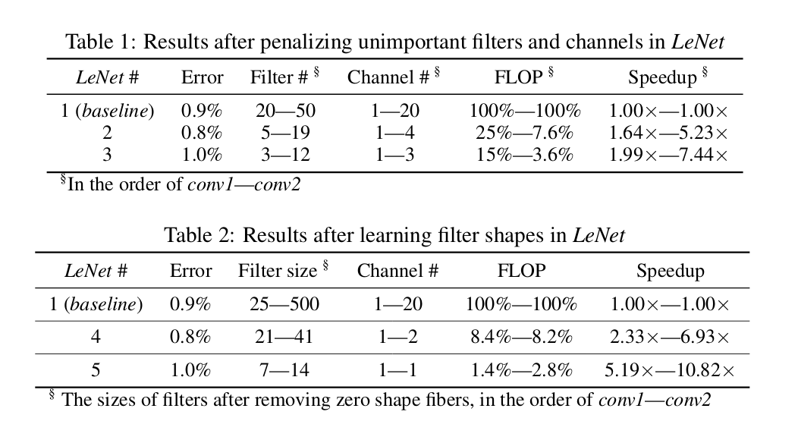
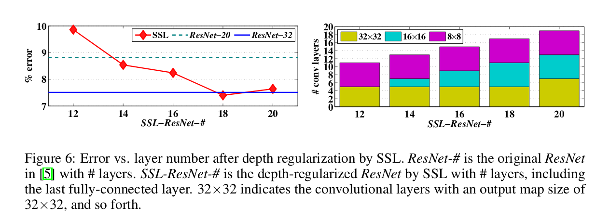

## Learning Structured Sparsity in Deep Neural Nets 

### Summary
Authors use Group Lasso on conv. nets to induce sparsity and propose several schemes of grouping the weights to induce structured sparsity.
They deem this method Structured Sparsity Learning (SSL).

### Structured Sparsity Learning Method for DNNs
In this part (Section 3) authors experiment with the definition of weight groups in Group Lasso, and see which schema works best.
Proposed schemas are:

- Penalizing unimportant filters and channels
- Penalizing shape fibers (defined in the paper, this allows them to learn arbitrary shapes of filters)
- Entire layers (thus relying only on the resnet shortcut-connection)

### Structured Sparsity Learning for computationally efficient structures

### Experiments and results
Results on LeNet using filter+channel-wise penalization as well as shape fiber penalization can be seen below.
 

SSL can be extended to learn the structure of FC layers (i.e. the number of neurons). Group Lasso Reg. is enforced on all the input (or output) connections of each neuron. 

Authors also apply the method on a convnet and a deep ResNet on CIFAR-10. When regularizing filters, channels, and filter shapes, the results and observations of both networks aresimilar to that of the MNIST experiment.  Moreover, they simultaneously learn the filter-wise and shape-wise sparsity to reduce the dimension of weight matrix in GEMM of ConvNet. They also learn the depth-wise sparsity of ResNet to regularize the depth of the DNNs.
Depth regularization of SSL can be viewed in the figure below.
 

Speedup they achieve is better than that of sparse networks induced by L1  norm. SSL can achieve on average ~3x speedup on GPU whereas non-structured sparsity obtain no speedup on GPU platforms. On CPU, both platforms can ahieve good speedups. Nonetheless, SSL achieves on average ~2x speedup on CPU compared to non-structured sparsity.