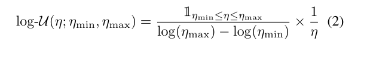
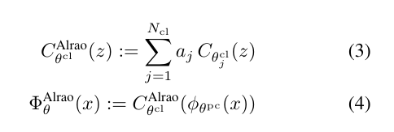
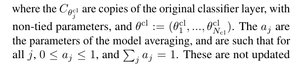
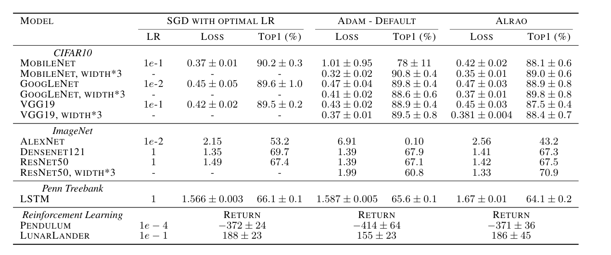
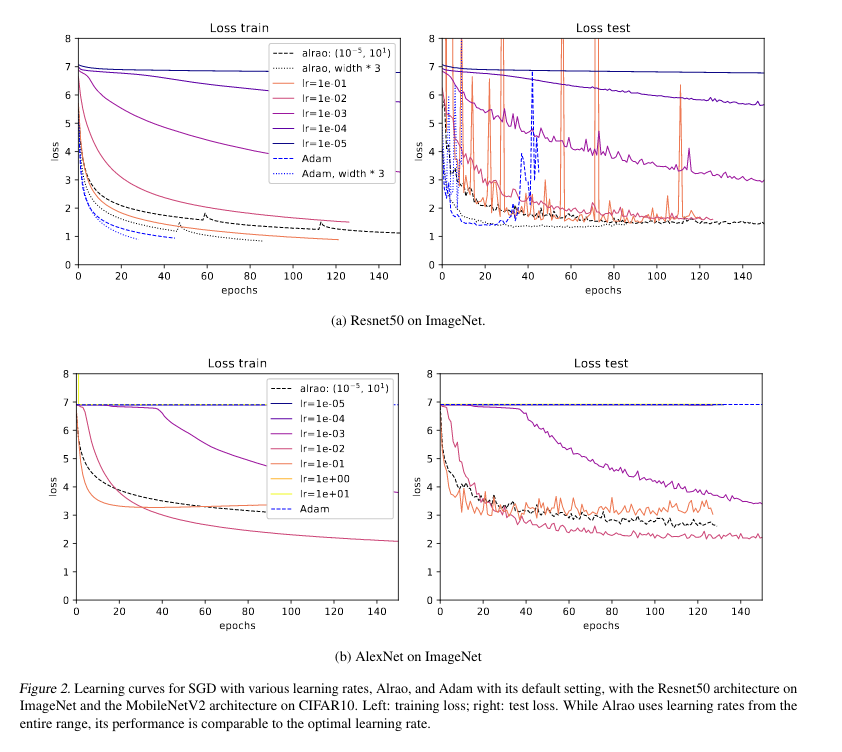

## Learning with random learning rates

### Summary
Authors introduce alrao (all learning rates at once), a gradient descent method with close-to-optimal performance without learning rate tuning. Alrao is found to be reliable over a range of problems and architectures including convolutional networks, LSTMs or reinforcement learning.
They also compare Alrao to the current default optimizer, Adam, with its default hyperparameters. While Adam can outperform Alrao sometimes, it is generally unreliable across varying architectures or during training.
The motivation is to find an optimizer that works well out-of-the-box and does not require learning rate tuning.
Main idea behind alrao is that not all neurons in a network are useful anyway, leveraging the redundancy to produce a diversity of behaviours from which good network outputs can be built. While Adam works well and doesn't need to have parameters tuned, the fine-tuning and scheduling of the learning rate is still frequently needed.

### Method
Alrao starts with a standard optimization method (i.e. SGD) and a range of possible learning rates. Instead of using one learning rate, we sample once and for all one learning rate for each feature, randomly sampled log-uniformly from \\(\eta_{min}, \eta_{max} \\). Then, these learning rates are used in the usual optimizatoin update:
$$ \theta_{l,i} \leftarrow \theta_{l,i} - \eta_{l,i} \nabla_{\theta_{l,i}} L(\Phi_\theta (x), y)$$
where \\(\theta_{l,i}\\) is the set of parameters used to compute the feature i of layer l from the activations of layer l-1 (the incoming weights of feature i). Thus we build slow-learning and fast-learning features, in hope to get enough features in the "Goldilocks zone".

**What is a feature?** Depends on the type of layers in the model. In FC layer, each component of a layer is considered as a feature: all incoming weights of the same unit share the same learning rate. In a conv layer, however, each conv filter represents a feature. There is one learning rate per filter (or channel) thus maintaining translation invariance over the input image. 

**This method cannot be used in the last layer!**. In classification, for example, it would lead to preferring certain classes over others. Instead, what authors do is, on the last layer, they duplicate it using several learning rates, and use a (Bayesian) model averaging method to obtain the overall network output.
 
The learning rate is set per feature, rather than per parameter, since every feature would have some parameters with large learning rates, and we would expect that even a few large incoming weights would be able to derail a feature.

Authors denote \\(log-\mathcal{U}(\bullet;\eta_{min}, \eta_{max}) \\) the log-uniform probability distribution over an interval \\((\eta_{min}, \eta_{max})\\). Namely, if \\( \eta \sim log-\mathcal{U}(\eta; \eta_{min},\eta_{max})\\) then \\(\log \eta\\) is uniformly distributed between \\(\log \eta_{min}\\) and \\(\log \eta_{max}\\). The density function is:
 

**ALRAO for the pre-classifier:** in the pre-classifier, for each feature in each layer, a learning layer \\(\eta_{l,i}\\) is sampled from the log-uniform distribution once and for all at the beginning of training. The parameters are then trained and updated normally.

**ALRAO for the classifier:** in the classifier layer, we build multiple clones of the original classifier layer, set a different learning rate for each, and then use a model averaging method from among them. The averaged classifier and the overall ALRAO model are:
 
 
The \\(a_j\\) terms are not updated via gradient descent, but by using a model averaging method from the literature. 

**Update Rule:** The update rule for the pre-classifier is the usual SGD update rule, with per-feature learning rates. For the parameters of each classifier clone j, they are updated as if this classifier alone was the only output of the model. With the pre-classifier still being shared. This ensures that classifiers with low weights \\(a_j\\) still learn, and is consistent with model averaging philosophy. Algorithmically this requires differentiating the loss \\(N_{cl}\\) times with respect to the last layer (but no additional backprop through the preclassifier).

To **adjust the weights \\(a_j\\)**, several model averaging techniques are available, such as Bayesian Model Averaging. Authors use the switch model averaging (whatever the hell that is, check paper for link and details).
### Experimental Setup
ALRAO was tested for image classification (Cifar10, Imagenet), text prediction (LSTM) and two RL problems. Baselines: SGD with optimal lr, Adam with default settings (arguably the default method).
 
For CNNs and RL, the intervals of the distribution were \\([1e-5,;1]\\) For RNNs, the intervals were \\([1e-3, 1e+2]\\). Results  are averaged across several runs. Confidence intervals presented are the standard deviatoin over these runs. Overall results are not bad.
 
### Performance and Robustness of Alrao
#### Compared to SGD with optimal learning rate
As expected, Alrao usually performs slightly worse than the best lr with SGD. However, even with wide intervals, it comes reasonably close to the best learning rate across every setup. This occurs even though SGD obtains good performance only for a few learning rates within the interval \\([\eta_{min}, \eta_{max}]\\).
#### Compared to Adam
ALRAO learns reliably across all setups tested. Performance is close to SGD in all cases. In Table 1, Adam has particularly bad performance in three cases. One is due to optimization issues (AlexNet on ImageNet), the other two are caused by strong overfitting. In two other cases, Adam gets good validation performance but overfits shortly after; this confirms the known risk of overfitting of Adam.  Overall, default Adam gives slightly better results than Alrao when it works, but doesn't learn reliably with its default hyperparameters. On the other hand, ALRAO reaches in every case close-to-optimal performance, thus being much more stable.

### Limitations
**The num. of parameters in the classification layer is increased.** For ImageNet or language models this means a huge increase in the total amount of parameters. 
**It removes the learning rate, but adds two hyperparameters.** This is technically true, however as long as the range contains reasonable learning rates, ALRAO still works. (Fig. 3 in paper shows the sensitivity to the choice of the interval bounds).
**Increasing network size.** ALRAO works well even for networks with a limiting width factor. However, the full benefits are only achieved for wider networks.
**Other optimizers, other hparams, lr schedulers** LR scheduling not included in the study, however it would be theoretically possible. ALRAO can be used with other optimizers than SGD; authors tested ALRAO with Adam, but results were less reliable. It exacerbates Adam's risk of overfitting. ALRAO could also be used for other hyperparameters. However, if more hparams are initialized randomly for each feature, the number of features that are in the "Goldilocks zone" would quickly decrease. 