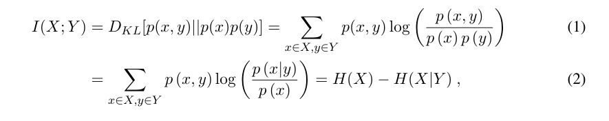
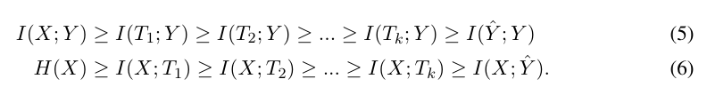

### Opening the black box of deep neural networks via information

#### Methodology
Treat each layer as a single random variable, characterized by its encoder P(T|X) and decoder P(Y|T) distributions. As we're only interested in the information that flows through the network, invertible transformations of the representations, that preserve information, generate equivalent representations even if the individual neurons encode entirely different features of the input. For this reason we quantify the representations by two numbers, or order parameters, that are invariant to any invertible re-parameterization of T, the mutual information of T w.r.t. input X and the desired output Y.

The quality of the layers is quantified by comparing them to the information theoretic optimal representations, the Information Bottleneck representations, and then describe how Deep Learning SGD can achieve these optimal representations.

**Mutual Information of two r.v.s is :**
 
Where KL is Kullback-Leibler divergence and H(X) and H(X|Y) is the entropy and conditional entropy respectively. 
The mutual information quantifies the number of relevant bits that the input variable X contains about the label Y, on average. 
The optimal learning problem can be cast as learning the optimal encoder of the relevant information via an efficient representation.
Two properties of the mutual information are very important in the context of DNNs, namely its invariance to invertible transformations:
\\( I(X;Y) = I(\psi(X);\phi(Y))\\)
and the data processing inequality: for any 3 variables that form a Markov chain X->Y->Z:
\\(I(X;Y) \gt I(X;Z)\\)

**The Information Plane:**
Any representation variable T, defined as a map of the input X, is characterized by its joint distributions with X and Y, or by its encoder-decoder distributions, P(T|X) and P(Y|T), respectively. Given P(X;Y), T is uniquely mapped to a point in the information plane with coordinates (I(X;T),I(T;Y)). When applied to the Markov chain of a K-layer DNN, with \\(T_i\\) denoting the i-th hidden layer as a single multivariate variable, the layers are mapped to K monotonic connected points in the plane - henceforth a unique information path - which satisfies the following DPI chains:

 