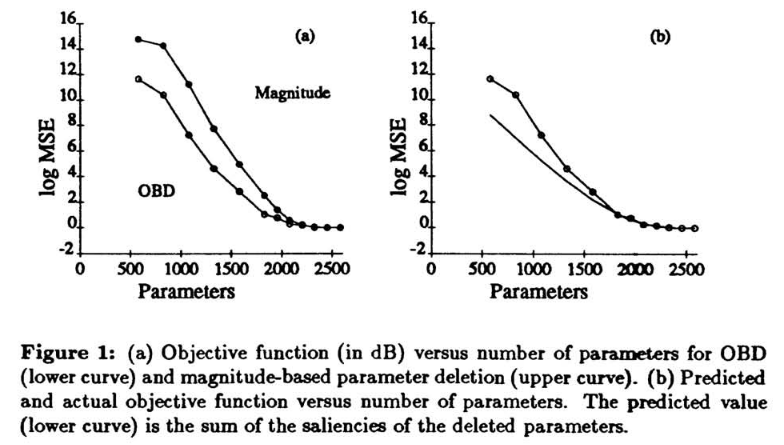

# Optimal Brain Damage
[Link to paper](http://papers.nips.cc/paper/250-optimal-brain-damage.pdf)

##### *Original pruning paper by LeCun*

By removing unimportant weights from a  network, sev-eral improvements can be expected. The basic idea is to use second-derivative informa-tion to make a  tradeoff between network complexity and training set error. 

> *Introduction contains some references to complexity measures for NNs*

##### Back in the day people used to:

> Note: often also applied to shallow learning

Simply delete parameters on a criterium to reduce overfitting. Think of Regularization (e.g. Weight decay). In most cases in the statistical inference literature, there is some a  priori or heuristic information that dictates the order in which parameters should be deleted. In a  neural network, however, it is not at all obvious in which order the parameters should be deleted. 

## Derivation:

> Introduces magnitude based pruning and iterative pruning. Refers to some sources as well

*"Two drawbacks of these techniques are that they require fine-tuning of the "prun-ing" coefficients to avoid catastrophic effects, and also that the learning process is significantly slowed down. Such methods include the implicit hypothesis that the appropriate measure of network complexity is the number of parameters (or sometimes the number of units) in the network. One of the main points of this paper is to move beyond the approximation that "magnitude equals saliency" , and propose a theoretically justified saliency measure. We define the saliency of a parameter to be the change in the objective function caused by deleting that parameter. Fortunately, it is possible to construct a local model of the error function and analytically predict the effect of perturbing the parameter vector. The goal is to find a set of parameters whose deletion will cause the least increase of E ."*

> By Taylor expansion they approximate the change in E (delta loss function).

**Problem:** Hessian is too big

**Solution:** The "diagonal" approximation: *the delta-E caused by deleting several parameters is the sum of the delta-E's caused by deleting each parameter individually*
Or put differently; only get the diagonal, assume independence. 

> Goes on to define formulas to compute diagonal elements

*"As can be seen, computing the diagonal Hessian is of the same order of complexity as computing the gradient."*

## OBD method:
 
1. Compute the second derivatives for each parameter 
2. Compute the saliencies for each parameter from that
3. Sort the parameters by saliency and delete some low-saliency parameters 
4. Iterate to step 1

Deleting a parameter is defined as setting it to 0 and freezing it.

## Results

**Magnitude pruning vs second order derivative**

- Similar results without retraining

## Conclusion

- They reduce number of params 4x (but as it was written in the 90s, there were only a couple of thousands to begin with)
- Been able to move beyond the approximation that "complexity equals number of free parameters" by using second-derivative information.
- The main idea is that a "simple" network whose description needs a  small number of bits is more likely to generalize correctly than a  more complex network, because it presumably has extracted the essence of the data and removed the redundancy from it. 