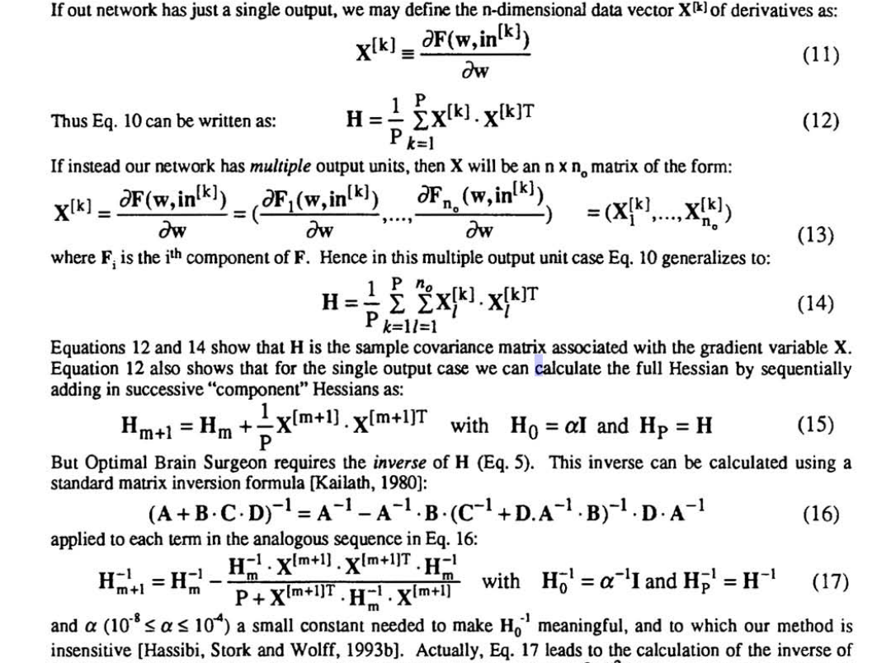
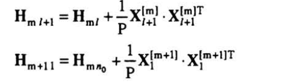

## Optimal Brain Surgeon

This paper is a follow-up to Optimal Brain Surgeon.
OBD assumes that the Hessian matrix is diagonal, whereas in practice the Hessian is strongly non-diagonal. OBS does not make this assumption.

They need to calculate the inverse of the Hessian tho.
They start from the same calculation as OBD, and derive, using a Lagrangian, a formula for simultaneously pruning weights and updating the ramining wegiths, without need for gradient descent.

However, OBS requires actually calculating the inverse of the Hessian, which is \\( \mathcal{O}(n^3)\\). However, they offer a general derivation of the inverse Hessian for a fully trained neural network. They show that the Hessian can be reduced to the sample covariance matrix associated with certain gradient vectors. The covariance form of the Hessian yields a recursive formula for computing the inverse.

They show that the Hessian can be calculated as:
 

So from eq. 12 and 14, the Hessian can be computed as the sample covariance matrix associated with the gradient variable X. Eq. 12 also shows that for the single output case we can calculate the full Hessian by sequentially adding in succesive "component" Hessians.

However, OBS requires the inverse. The inverse can be calculated using standard matrix inversion. The first Hessian is initialized as alpha times identity, where alpha is a parameter (to which they claim their method is insensitive). Eq. 17 allows calculating the Hessian using a single sequential pass through the data. Eq 17 can also easily be extended to multiple output case (we have recursion on both the indices m and l) giving:

 

The final computational complexity of the inverse Hessian is:
\\(\mathcal{O}(P n^2) \\), where P is the number of samples in the train set and n is the number of params in the network (I think?), and is therefore of the same complexity as calculating the Hessian.