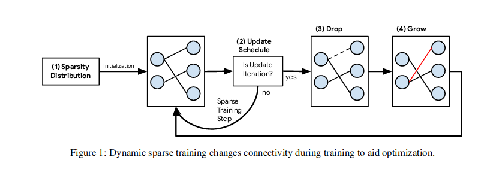

# Rigging the Lottery: Making All Tickets Winners
[link to paper](https://arxiv.org/pdf/1911.11134.pdf) 

*Follow-up paper of <u> the state of sparsity</u>. There is a large body of work on training dense networks to yield sparse networks for inference. Introduce a method to train a fixed parameter-count throughout training. The method  updates  the  topology  of  the  network  during  training  by  using  parameter  magnitudes  and infrequent  gradient  calculations. They show it reduces FLOPS. Can start at any initialisation. Beat benchmarks as it is memory efficient, computationally efficient and accurate. The improved performance of RigL is due to two reasons:*
  
 - *the use of a new method foractivating connections that is efficient and more effective than choosing at random*
 - *the use of a natural extensionto an existing method for distributing parameters statically among convolutional layers.*

** They introduce the Rigged Lottery Algorithm (RigL)**

## Related work

Limitations of previous work:

- The maximum size of sparse models is limited to the largest dense model that can be trained.
- Still using a lot of FLOPS during training
- It is inefficient.  Large amounts of computation must be performed for parameters that are zero valued or thatwill be zero during inference.
- It remains unknown if the performance of the current best pruning algorithms are an upper boundon  the  quality  of  sparse  models.
- Even LTH needs reinitialisation and multiple successive iterations of pruning cycles
 
**see table 1**

## Method

In a nutshell:

1. define sparsity distribution
2. determine update schedule 
3. Remove some connections
4. Add some connections
5. Train a little
6. Repeat 3-5 during training
7. stop at some point

 

**1.** For this purpose they apply a **prior sparsity ditribution** to determine per-layer sparsity, of which they tried the following:

- Uniform: all layers get pruned equally
- Erdos-renyi: some fraction that gives higher percentages if there is more params
- ERK: the former with some specifications for convs

**2 the schedule** defines:
- How often we update weights and how ofter we update connections.
- When we stop
- fraction of connections updated in the beginning
- decay annealing function that updates the updated connections fractions

**3. drop criterion** determines when which weights to prune, for which they use magnitude based pruning

**4. grow criterion** determines which weights arre added back in. which is determined by <u>highest magnitude gradients</u>. Newly activated connections get initted with 0 but are not frozen so they will recieve grads.

## Conclusion

- Tested on Imagenet. Best performance per flop and per pre-set sparsity. 
- Static networks undeperform to dynamic architectures. 
- Networks that can also grow are better
- ERK is the best sparsity prior (although it requires a lot of flops in its own)
- Update frequency is 100 and initial drop fraction is 0.4
- dynamic mask methods have consistent lower loss in comparison with static methods (see fig 6, dont really get left)

## Limitations

- results on schedules seem model dependent
- Difficult annealing scheduling needed for phase 2
- Lot of new hyperparams traded in for the old ones
- Uses warmup
- I feel a bit of bias towards their own methods/papers
