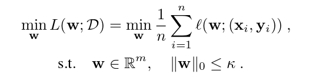
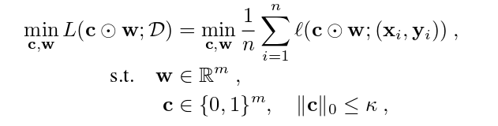
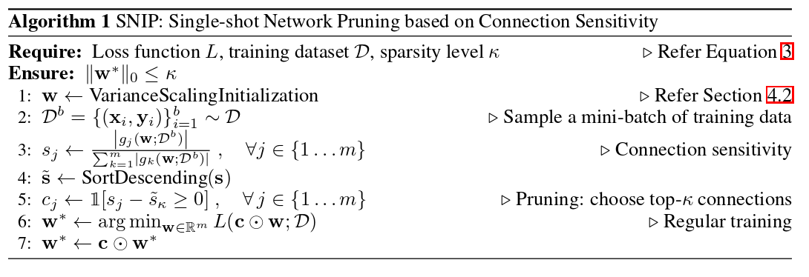
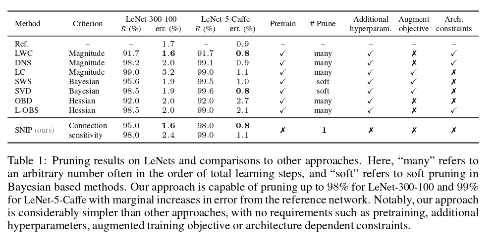
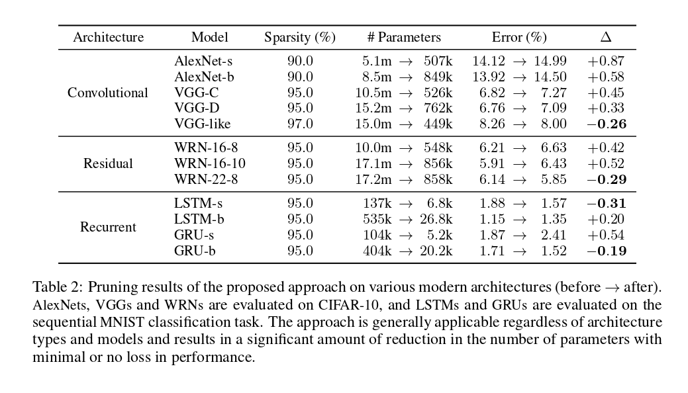

### SNIP: Single-shot Network Pruning based on Connection Sensitivity

#### Summary
- SNIP allows for pruning the network at initialization
- It uses a saliency criterion based on connection sensitivity. (it is data dependant)
- Idea is to find the weights that least influence the loss function
- It uses the scaled gradient of each weight's mask variable as an indicator

#### Derivation
Neural network pruning can be framed as the following optimization problem:
 
where D is the dataset, k the desired sparsity level (the number of non-zero weigths), w the set of parameters, m the total number of parameters and l is the standard loss function (i.e. cross-entropy).
Authors introduce an auxiliary indicator variable \\(c 
\in \{0,1\}^m \\). Therefore,  this modifies the above equation to:
 
The idea is that now we have separated the weight of the connection (w) from whether the connection is present or not (c). With this, we're now able to determine the importance of each connection by measuring its effect on the loss function.

For instance, \\(c_j\\) indicates whether connection j is active (\\(c_j=1\\)) or pruned (\\(c_j=0\\)).  Now, to measure the effect of connection j on the loss, we can try measuring the difference in loss when \\(c_j=1\\) and \\(c_j=0\\), keeping everything else constant. The effect of removing connection j can then be measured by:
$$\Delta L_j(w;D) = L(\mathbf{1} \odot w;D) - L((1-e_j)\odot w;D)$$
where \\(e_j\\) is the indicator vector of element j. (i.e. zeros everywhere except at index j where it is 1) and \\(\mathbf{1} \\) is a vector of ones of dimension m.
Computing \\( \Delta L_j\\) for each \\(j \in {1..m} \\) is prohibitively expensive as it requires m+1 forward passes. Also, since c is binary, it's not even differentiable. So, by relaxing the binary constraint on the indicator variables c, \\( L_j  \\) can be approximated by the derivative of L w.r.t. \\(c_j\\), which is denoted by \\(g_j(w;D)\\). So the effect of connection j on the loss can be rewritten as:
$$\Delta L_j(w;D) \approx g_j(w;D) = \frac{\partial L(\mathbf{c} \odot w;D)}{\partial c_j}= \lim_{\partial \rightarrow 0} \frac{L(\mathbf{c} \odot w;D)-L((\mathbf{c}-\partial e_j)\odot w;D)}{\partial}$$
Effectively this measures the rate of change in L w.r.t. an infinitesimal change in \\(c_j\\) from \\(1 \rightarrow 1-\partial\\). This can be computed efficiently in one forward-backward pass for all j at once. This formulation can be viewed as perturbing the weight \\(w_j\\) by a multiplicative factor \\(\partial\\) and measuring the change in loss. 
Thus, the magnitude of the derivatives \\(g_j\\) can be used as a saliency criterion in the pruning process.
If the magnitude is high, the effect it has on the loss is big, so it should not be removed. Based on this, authors define connection sensitivity as the normalized magnitude of the derivatives:
$$ s_j = \frac{|g_j(\mathbf{w};D)|}{\sum_{i=1}^m |g_i(\mathbf{w};D)}$$
Once sensitivity is computed, only the top-k connections are retained, with k being the number of desired non-zero weights.

**How is this different from other saliency criterion?**
In earlier works, other saliency criterion were used, such as \\(-\frac{\partial L}{\partial \mathbf{w}}\\) or \\(-\frac{\partial L}{\partial \mathbf{\alpha}}\\), where \\( \alpha\\) refers to the connectivity of neruons. These criterion, however, depend on the loss value before pruning, which requires pre-training and iterative optimization cycles. In contrast, the saliency criterion defined here measures the sensitivity as to how much elements have on the loss function regardless of whether it is positive or negative, thus alleviating the dependency on the value of the loss, so no need for pre-training.

Algorithm is summarised below.
  
#### Single-shot pruning at initialization
To minimize impact that the weights have on the derivaties \\(\frac{\partial L}{\partial c_j}\\), proper initialization must be used, (any standard initialization scheme like Glorot etc. should work) ensuring gradients are within a reasonable range, such that activations do not saturate (this would lead to uninformative gradients).
Also, since the criterion is dataset dependent, a forward pass is required. Authors show that using only one reasonably-sized mini-batch is sufficient to lead to effective pruning.

#### Experiments and results
Generalizes to many modern networks. Achieves negligible loss in performance on LeNet for sparsity of 90%. Works across architectures (LSTM, convnets, ResNets etc). Results below.
 
 

#### Effects of data and weight initialization
Size of mini-batch is marginal, but nevertheless notable. Variance scaling initialization (Glorot et al, He et al.) are essential for this method to work properly.