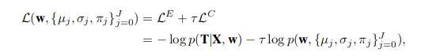

# Soft Weight Sharing for Compression
[link to paper](https://arxiv.org/pdf/1702.04008.pdf)

*Bayesian approach that achieves both quantization and pruning in one simple training procedure. This point of view also exposes the relation between compression and the minimum description length (MDL) principle.*

## Some notes:

- Much related to the Bayesian Compression paper by:
	- Bits back argument
	- Mixture of gaussians
- really focussed at compression (*which is alligned according to Hinton and van camp 1993*). 
- Compression is achieved because we only need to encode K cluster means (in full precision) in addition to the assignment of each weight to one of these 

## Motivation

1. Start with the ELBO. The 'likelihood' term of this loss lower bounds the expected amount of information needed to communicate the targets, given input *x* and model *w* (claimed by *Shannons soruce coding theorem*). 
2. Now the KL divergence:
$$KL(q(w)||p(w))$$
 lower bounds the model *w* in the same way. In the field of information theory, this specifies the cost of communicating *w*. Which we can split up furter into:
 $$= E_{q(w)}[-log\ p(w)] - H(q(w))$$
3. It has been shown through this formula that noisy encodings of the weights is not hurting the loss and compresses the networks size (**= bits back argument**). Practically this means lowering bits per parameter encodings and the more coarse the quantization of weights the more compressible the model.
4. There are some assumptions however:
	- Weights are transmitted idependently.
	- Weights are independent (no mutual inf).
	- Prior is known and shared.

Which are very exploitable.
5. Recall that the cross entropy is a lower bound on the average number of bits required toencode the weights of the neural network (given infinite precision. They try now to find a good prior for this: Mixture of Gaussians:
$$p(w) = \prod_{w_i \in w} \sum^j \pi_j N(w | \mu_j, \sigma_j^2) $$
And they learn the gaussians and their weights \\(\pi_j\\) during training. 
> So a weighted sum of globally shared gaussians for each weight.

## Method

6. By enforcing an arbitrary “zero” component to have fixed μ0= 0 location and π0 to be close to 1, a desired weight pruning rate can be enforced. The approach naturally encourages quantization because in order to optimizethe cross-entropy the weights will cluster tightly around the cluster means. while the cluster meansthemselves move to some optimal location driven by SGD.
> Note that, mixture components merge when there is notenough pressure from the error loss to keep them separated because weights are attracted by means and means are attracted by weights hence means also attract each other
8. Redefine the optimisation problem to:

Where we split up the KL term into Motivation step 2. Because the entropy doesn't depend on entropy we end up with the prior only.
9. Set \\(\tau=0.005\\) for some reason
10. All mixing components are learned in the process, except: \\(\pi_0=0.999\ \ \mu_0=0\\), They use 17 other components (\\(\pi\\)'s).
11. The Gaussian mixtures will collapsevery fast as long as the error loss does not object.  However if it collapses too fast weights mightbe left behind, thus it is important to set the learning rate such that the mixture does collapse toosoon. If the learning rate is too small the mixture will converge too slowly. 
12. After re-training we set each weight to the mean of the component that takes most responsibility forit i.e.  we quantize the weights. 
13.  Before quantizing, however, there might be redundant components, which we can remove.

## Results

- Good clustering of params
- About 96% pruning rate
- Some components are absorbed into others

## Conclusion

- Automatic pruning percentages
- Gaussian mixture moddeling style clustering on the weights itself, with hard assignment in the end
- At the time state of the art performance

## Limitations

- Training dynamics might collapse if not managed, specifically learning rate.
- Requires good initialisation for the Gaussians components (they do learn though)
- Can collapse, so needs inverse gamma priors sometimes
- Bayesian optimization 