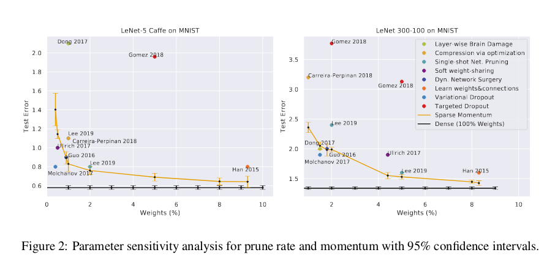

### Sparse Networks from scratch: Faster Training without losing performance

#### Summary
The algorithm consists of three main steps:
1. Calculate average momentum contribution per layer
2. Prune smallest p% weights from each layer
3. Regrow weights according to missing weights momentum. Number of regrown weights is equal to the number of weights removed in the earlier step. This is done by enabling the gradient flow of zero-valued (missing) weights which have the largest momentum magnitude.
Algorithm is visually presented below.
 

#### Sparse Momentum
The gradient of the error w.r.t. weights, \\(\frac{\partial E}{\partial w}\\) yields the direction which reduces the error at the highest rate. However, if using SGD, most weights will oscillate between small/large and positive/negative. To reduce oscillations, use average gradient over time. However, most recent gradients, which are closer to the local minimum, should be valued more. This can be achieved by exponentially smoothing \\(\frac{\partial E}{\partial w}\\) - the momentum \\(\mathbf{M}_i\\).
$$\mathbf{M}_i^{t+1} = \alpha M_i^t + (1-\alpha)\frac{\partial E^t}{\partial W_i}$$
Intuitively, we want to take weights from less efficient layers and redistribute them to weight-efficient layers. Additionally, the momentumof zero-valued weights – equivalent to missing weights in sparse networks – can be used to estimatehow quickly the error would change if these weights would be included in a sparse network.
After each epoch, the prune rate \\(p\\) is decayed, similar to how learning rates are decayed (cosine or linear schedules).
**Two edge cases**
- If we allocate more weights to be regrown than is possible for a specific layer (regrowing 100 weights for a layer of maximum 10 weights), the excess number of weights is redistributed equally among the other layers
- For some layers, the algorithm will converge in that the average weight in layer \\(i\\) has much larger momentum magnitude than weights in other layers, but at the same time, this layer is dense and cannot grow further. We do not want to prune weights from such important layers. So, for these layers, we reduce the prune rate \\(p_i\\) proporotional to the sparsity: \\(p_i=\min (p, sparsity_i) \\).

#### Results
For 1-2% percent of weights, variational dropout is more effective - but this method also uses dropout for further regularization, while authors only use weight decay. Sparse momentum achieves equal performance to the dense network with only 8% weights. 

On CIFAR-10, sparse momentum outperforms SNIP for all models and can achieve the same performance level as a dense model for VGG16-D with just 5% weights. Authors also measure speedup and how many weights are needed for dense performance levels (see paper for more details).

 Authors also perform ablation study on their regrowth and redistribution strategies (momentum/None for redistributin, and momentum/random for growth, yielding 4 combinations).  Redistributing weights according to the momentum magnitude becomes increasinglyimportant the larger a network is. Also, for big networks, momentum growth outperforms random growth by a large margin. For small networks, redistribution and random growth seems to be sufficient. However, random growth without redistribution cannot find good weights. These results suggest that with increasing network size a randomsearch strategy becomes inefficient and smarter growth algorithms are required for good performance.
 
 Authors also perform a sensitivity test to the hyperparameters : prune rate and momentum.
 
