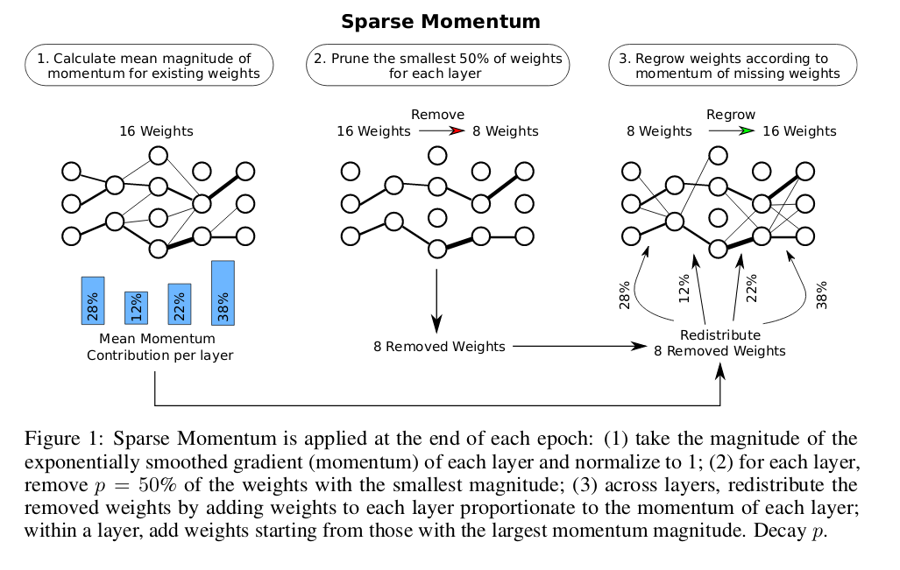

### Sparse Networks from scratch: Faster Training without losing performance

#### Summary
The algorithm consists of three main steps:
1. Calculate average momentum contribution per layer
2. Prune smallest p% weights from each layer
3. Regrow weights according to missing weights momentum. Number of regrown weights is equal to the number of weights removed in the earlier step.
Algorithm is visually presented below.
 