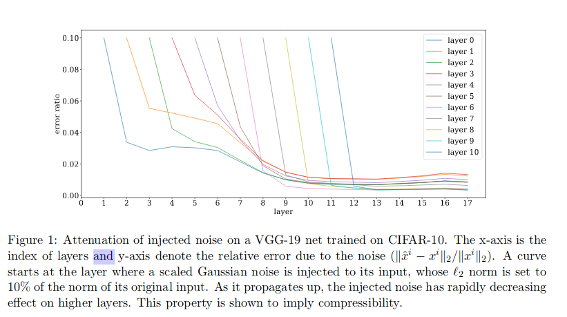

# Stronger generalization bounds for deep nets via a compression approach
[Link to paper](https://arxiv.org/pdf/1802.05296.pdf) 

*"Deep nets generalize well despite having more parameters than the number of training samples. Current approaches do not as yet have a metric in sample complexity bounds better than naive parameter counting. Our results also provide some theoretical justification for widespread empiricalsuccess in compressing deep nets."*

> "Sample Size Upper Bounds" keeps getting mentioned, is this upper confidence bound???

## Related work
- Some papers have suggested that nets that generalize well are flat  minima in the optimization landscape.
- Some papers show using experiments that sharp minima correlate with higher generalization error.
- A quantitative version of “flatness” (= stability) was suggested:  the net’s output is stable to noise added  to  the  net’s  trainable  parameters.
	> results were worse than naive counting
- Another method: noise on nodes. (like dropout and batchnorm..)

## Contributions

- Compression framework for proving generalisation bounds
- Identifying new form of noise stability for nets
- Mathematically proven algorithm that reduces parameters and yields generalization bounds that are:
	- better than naive counting
	- simple
	- workable for multiple layer-types

 

***to be continued...***