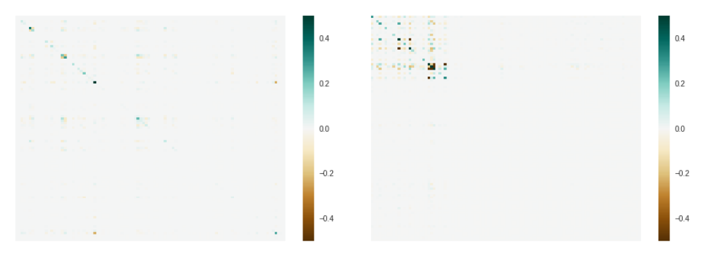
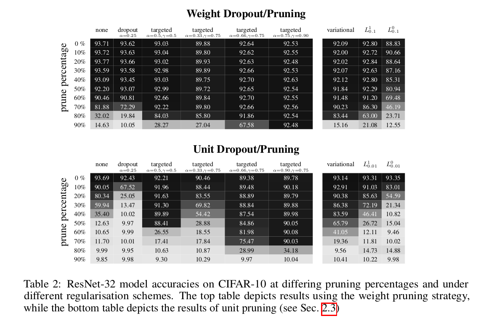

## Targeted Dropout
[Link to paper](https://openreview.net/pdf?id=HkghWScuoQ) 

*"Our approach is based on the observation that dropout itself enforces sparsity during training, by sparsifying the network with each forward pass. This encourages the network to learn a representation that is robust to a particular form of post hoc sparsification – in this case, where a random set of units are removed. Our hypothesis is that if we plan to do explicit post-hoc sparsification, then we can do better by specifically applying dropout to the set of units that wea priori believe are the least useful."*

So normal dropout but then for some targeted params.

## Summary
- Authors propose using targeted dropout as a way of enforcing sparsity tolerance during training
- Idea is to apply dropout to the set of weights/units that we apriori believe are least useful
- Rank weights by some approximate measure of importance (i.e. magnitude), then apply dropout with prob. p only to k% least important weights
- This encourages the network to be robust to our choice of post-hoc pruning strategy
- Authors experiment with magnitude-based pruning as the criterion. For the drop strategy, they experiment with both dropout and dropconnect. (unit dropout and weight dropout)

## Targeted Dropout
<u>Goal of targeted dropout is to reduce the dependence of the *important subnetwork* on the *unimportant subnetwork*.</u>

Select a targeting proportion \\(\gamma\\) and a drop probability \\(\alpha\\). Targeting proportion means we select the bottom \\(\gamma|\theta|\\) weights as candidates for dropout, and we drop them independently with drop rate \\(\alpha\\). Thus num. elements kept each round of targeted dropout is \\((1-\gamma \alpha)|\theta|\\). 

## Experiments

In order to analyze the effects of targeted dropout, authors construct a toy experiment with small dense networks to analyse properties of the network's dependence on its weights. 

In the figure below, a comparison between a network without dropout (left) and a network with targeted dropout (right) of the matrix formed by multiplying the hessian and the parameters of the network \\( \theta^T \odot H \odot \theta \\). In this figure, the last 75% weights being the ones we intend to prune. Note the stark differencebetween the two networks, with targeted dropout concentrating its dependence on the top left corner,leading to a much smaller error change after pruning.
 

For **ResNet-32**, results can be seen in tables below, for both weight and unit dropout, across various values for \\(\alpha\\) and \\(\gamma \\)
 

It can be seen that higher dropout rate applied to a larger proportion of the weights tends to yield better result. Also, standard dropout schemes are relatively weak compared to their targeted counterparts. Variational dropout also seems to improve things marginally over the unregularised baseline, but was still outperformed by targeted dropout **(cherry picked??? doesn't match state of sparsity paper). **

For L0 authors did a hyperparameter search for \\(\beta\\) and selected the best result, however it was fairly insensitive to the choice of the hyperparamter. Also, L0 regularisation seems to force the model away from conforming to the assumption of importance being described by parameter magnitude, unfortunately.

 For **WideResNe**t (table not included) L0 could fails to truly sparsify the network, but has a strong regularising effect on the accuracy of the network.
 
 
  
**Transformer** proved to be failry robust to pruning (figure above). However, targeted dropout also had big improvements in this case (15 BLEU points at 70% sparsity and 12 at 80%).

 
Comparing weight-level **Smallify** to targeted dropout, targeted dropout was outperformed at the high levels of sparsity. This is somewhat unsurprising since Smallify allows for different pruning rates between layers, thus is more flexible in finding the optimal pruning mask.

However, by using **ramping targeted dropout**, authors were able to achieve similarly high pruning rates. Ramping targeted dropout simply anneals the targeting rateγfrom zero, to the specified finalγthroughout the course of training.

Authors also propose a variation of ramping targeted dropout, where each layer is assigned a \\(\gamma\\) such that only a fixed number of weights are non-zero by the end of training, coined **Xtreme dropout**. ResNet32 when trained with Xtreme-3 (3weights per filter are non-zero) was able to achieve an accuracy of 84.7% on the CIFAR-10 datatset ata sparsity level of 99.6% while Xtreme-4 was able to achieve 87.06% accuracy at a sparsity level of99.47%. An interesting observation of Xtreme pruning is that when trained on ResNet18, it achieves82% accuracy at a sparsity level of 99.8%. When translated to the number of parameters, it has only29,760 non-zero parameters (includes BatchNorm) which is less than the number of parameters in anetwork consisting of a single dense layer with 10 output units.

## Limitations

- Annealing of targeted proportions
- Questionable results? or promising. I'm not sure