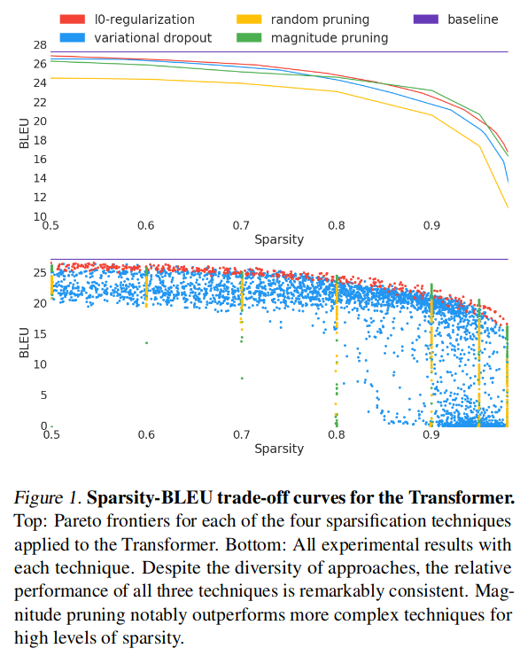
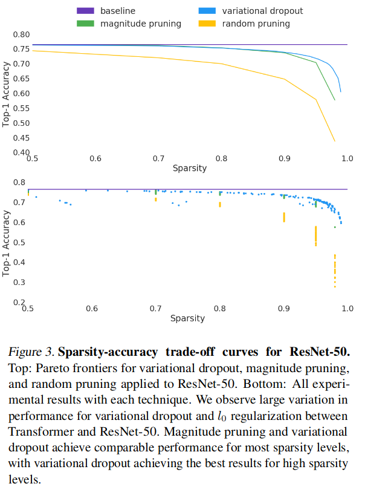

# The State of Sparsity in Deep Neural Networks
[Link to paper](https://arxiv.org/pdf/1902.09574.pdf)

*Looks at creating benchmarks for popular pruning techniques anno 2018*

#### Some notes:
- Authors argue there are no good benchmarks for model pruning.
- They also mention that LTH & lui et al. (2018) agree that pruning is about architecture search but dissagree on initialisation of weights.
- Focusses on unstructured sparcity

#### Contributions:
- Authors perform a comprehensive evaluation of:
	- variational dropout
	- L0 regularization
	-  magnitude pruning on large-scale networks. 
	
	They show that L0 and VD perform incosistently for such large-scale networks, and magnitude pruning can attain comparable results

- They achieve SOTA sparsity-accuracy trade-off for RESNET50 by only using magnitude pruning
- They repeat the lottery ticket (Frankle & Carbin, 2018) and scratch (Liu et al., 2018) experiments, on Transformer and ResNet-50, showing that unstructured sparse architectures learned through pruning cannot be trained from scratch to the same test set performance as a model trained with pruning as part of the optimization process. (**is before stabilizing paper though**)

## Methods that are evaluated

- **Magnitude based**: use the magnitude of each weight as a proxy for its importance to model quality. based on Shu & Gupta (2017).
- **Variantional dropout**: by learning a model with variational dropout and per-parameter dropout rates, weights with high dropout rates can be re-moved post-training.
- **l0-regularization**: see paper
- **Random pruning**: speaks for itself

## Results

- When applied to the Transformer, at high levels of sparsity, magnitude pruning outperforms both L0-regularization and VD. It is also much faster to train (1.24 and 1.65x respectively)

- L0 cannot produce sparse ResNet50 models without signifcant damage to quality.

- Results of VD and L0 across large networks are inconsistent 
	- For ResNet50, VD produces models as good as or better than magnitude pruning, while L0 cannot produe sparse models at all (**maybe not defined for convs??**)
	- While for Transformer the l0-regularization performs best, on par or better than magnitude pruning
- VD and L0 much more costly to train in terms of memory and compute
- VD on ResNet50 much more costly to train in terms of memory and compute
- Magnitude based pruning on ResNet50 with hand-crafted pruning was, at the time, State Of The Art in terms of sparsity-accuracy tradeoff.

### Per-layer Distributions
- For L0 and VD, per-layer pruning distribution is learned, while authors use a uniform distribution for MP. 
- Pruning methods that are integrated into the otpimization process (L0, VD) do not sparsify the input and output layers as much (they are known to disproportionately influence the performance of the network)
- Using a hand-crafted distribution and more training time (although training time probably not as important), MP performs even better, outperforming both VD and L0 at all but the absolute highest sparsity levels tested while also using less resources 
- VD's performance at the highest sparsity levels still notable
- It is likely that performance is tied to precise allocation of weights across layers, thus VD performs better on high sparsity levels on Resnet due to it learning this distribution	
	- This result indicates that efficient sparsification techniques that are able to learn the distribution of sparsity across layers are a promising direction for future work

### Pruning as architecture search

This bit is mainly about LTH and rethinking the value of network pruning. They say: *"The implications of being able to train sparse architecturesfrom scratch once they are learned are large: once a sparsetopology  is  learned,  it  can  be  saved  and  shared  as  withany other neural network architecture.   Re-training thencan be done fully sparse, taking advantage of sparse linearalgebra to greatly accelerate time-to-solution. However, thecombination of these two studies does not clearly establishhow this potential is to be realized."*

- They mention both studies only looks at MLPs and Convs
- Authors provide strong counter-examples to two recently proposed theories that models learned through pruning techniques can be trained from scratch to the same testset performance of a model learned with sparsification as part of the optimization process (e.g. l0-reg).
- Authors were not able to reproduce the results of the original LTH paper. However, they experimented with large datasets and models. This was before the stability paper got out which fixed that

## Limitations

- Set in stone hyperparameters in some cases, amongst whome is the training steps.
- stabilizing-LTH paper wasn't out yet
