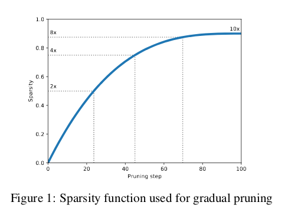
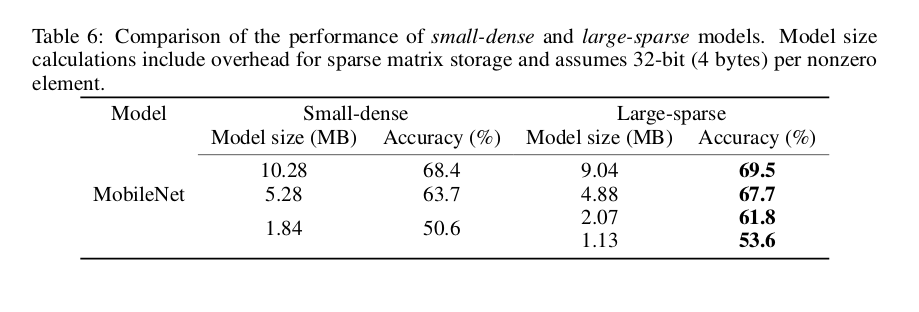
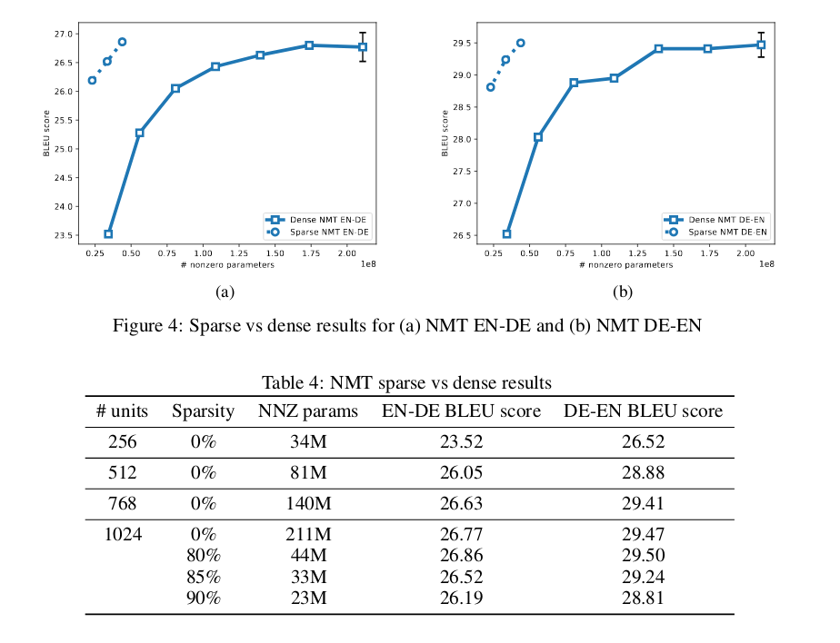

### To prune or not to prune: exploring the efficacy of pruning for model compression

#### Summary
- Authors propose a simple gradual pruning technique
- They compare large-sparse vs. small-dense networks, that is, large networks that were pruned and networks that were small to begin with.
- They find that large-sparse networks outperform small-dense networks.

#### Method: Gradual pruning
Authors propose a simple gradual pruning method. For each layer to be pruned, they add a binary mask and, mask out the smalles weights until a desired sparsity level \\(s\\) is reached. In gradual pruning, the sparsity level is increased from an initial value \\(s_i\\) (usually 0) to a final sparsity value \\(s_f\\) over a span of \\(n\\) pruning steps, starting at training step \\(t_0\\) with pruning freq. \\(\Delta t\\), resulting in the following equation:
$$s_t = s_f + (s_i - s_f) (1 - \frac{t-t_0}{n\Delta t})^3, \textrm{for } t \in \{t_0, t_0 + \Delta t, \dots , t_0 + n \Delta t \} $$
The binary weight masks are updated every \\(\Delta t \\) steps as the network trains, to gradually increasse the sparsity of the network, while also allowing the network to recover from any loss in accuracy induced by the pruning process. Once the final sparsity \\(s_f\\) is reached, the binary mask is no longer updated. A plot of this sparsity function as a function of the pruning step can be seen below:
 
The idea is to prune the network rapidly in the initial phase when the redundant connections are abundant and then gradually reduce the number of weights as there are fewer and fewer weights remaining in the network. In the paper, pruning is initiated after the model has been trained for a few epochs or from a pre-trained network (the \\(t_0\\) hyperparameter). 
The choice of \\(n\\) is largely dependant on the learning rate. Since it's common to decay the learning rate when using SGD, it's been observed that pruning when the learning rate is too low may make it difficult for the network to recover from the loss in accuracy caused by pruning in the subsequent training steps. Similarly, pruning with too high of a learning rate may mean pruning weights when they have not yet converged to a good solution, Therefore, the pruning schedule should be chosen in close relation to the learning schedule. 

#### Comparing large-sparse and small-dense networks
The sparsity parameter is shown to be an effective way to trade-off the accuracy of a model with its memory usage. Also, pruning seems to be a promising approach for model compression even for architectures that were designed to be compact and efficient using depthwise separable convolutions instead of standard convolutions as a factorization-like technique to reduce the number of parameters (Mobile Net). Some results can be seen in figures below, for MobileNet and an LSTM trained on Penn-Treebank language modeling task, comparing large-sparse and their small-dense counterparts.

 
 

For Google NMT model, authors noticed high variance in the results ,so they tested several pruning schemes applied to NMT. The standard method (as presented above) gradually increases the sparsity of every layer to the same sparsity level at each pruning step. A new variant, "layerwise constant" was tested, where instead of simulataneously pruning all layers, the pruning interval is subdivided and only one layer is pruned at a time. This can reduce the impact of pruning on network performance. Authors also compare with "global pruning": the smallest magnitude weights are pruned at each pruning step, regardless of which layer they happen to be in. 
Overall the layerwise pruning scheme performed best on average, so that is the one that is reported (figure below).
 

Overall, large-sparse models appear to achieve higher accuracy than small-dense models, when their memory footprint is comparable, across all tested neural network architectures. 