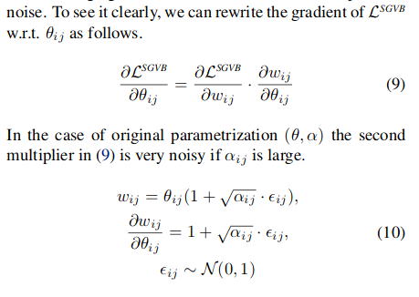

# Variational Dropout Sparsifies Deep Neural Networks
[Link to paper](https://arxiv.org/pdf/1701.05369.pdf) 
[Link to lecture by Authors](https://www.youtube.com/watch?v=CZ3fPKlHDoM) 

*Extend  Variational  Dropout  to  the  case  whendropout rates are unbounded,  propose a way toreduce  the  variance  of  the  gradient  estimatorand  report  first  experimental  results  with  individual dropout rates per weight. Find that it sparsifies up to a factor 280.*

- We have had Binary- and Gaussian dropout, which are special cases of Bayesian regularization
- Instead  of  injecting  noise (dropout)  we  can  regularize  a  model  by reducing the number of its parameters.
- Problem with normal Variational dropout is that uses a limited family for posterior ap-proximation  that  does  not  allow  for  ARD  effect.
## Derivation 

#### Variational Inference

 > **Note**: Section 3 contains a good summary of the thought process from bayesian inference to variational dropout. Here a small summary of that summary:
 
1. Take prior p(w)
2. Bayesian inference gives us 
$$p(w) \rightarrow p(w) \frac{p(D|w)}{p(D)} = p(w|D) \text{  [ posterior ]}$$
3. Posterior is actually **intractable**, *Variational Inference* is used to approximate p(w|D), measured in KL div:
$$D_{KL}(Q_{\phi}(w) || p(w|D))$$
Which relates to the marginal in the following way:
$$log\ p(y|x) = ELBO + D_{KL}(Q_{\phi}(w) || p(w|D))$$
4. Then we just need to find the parameters of this Q, done by optimizing the ELBO. 
$$ELBO $$ $$= L_D(\phi) - L_{KL}(\phi)$$ $$= E_{w\sim q(w)} p(y|x,w) - D_{KL}(Q_{\phi}(w) || p(w))$$ 
	- Where \\(L_D\\) is given by an unbiased approximation of sampling weights and getting log-likelihood \\(p(y|x,w_{\text{sampled}})\\):
	- Wheras \\(L_{KL}\\) is the difference between approximate posterior and prior, which we both choose.
5. ELBO lower bounds marginal p(y|x) ([see also](https://medium.com/@hfdtsinghua/derivation-of-elbo-in-vae-25ad7991fdf7)), but because that doesn't depend on Q because it is constant under parameters \((\phi\)) (see step 3), we consequently also have to minimize our desired \\(D_{KL}(Q_{\phi}(w) || p(w|D))\\)
6. Now w have Q(w|D). But sometimes these ELBO terms are too heavy too compute or the gradient doesn't flow through expectations.
	-  Use the Reparameterization Trick for gradient flow and variance reduction
	-  Use the Local-reparametrization trick to reduce variance further:
		- Seperate wieght matrices for each batch member
		- Move noise from weights to activations to make that computationally possible

#### Variational Dropout

7. Consider a layer as input (A), output (B) and weights (W), such that B=AW. Then dropout is: B=(A*E)W, where E is sampled noise. 
	- Normal dropout: \\(E \sim Bern(1-p)\\)
	- Gaussian dropout \\(E \sim N(1, \frac{p}{1-p})\\). 
	- Variational dropout: see next points.
8. In Gaussian Dropout you coulddo the following : Because of gaussian noise on a weight is is equivalent to sampling of said weight we sample weight matrices. \\(W \sim q(W|\theta, \alpha) = N(w|\theta , \alpha\theta^2)\\).
	- **Variational Dropout** extends this technique and explicitly uses this Q as a approximate posterior like in VI. They thus add a prior p(w), and choose one that fits Gaussian dropout. 
9. They show the KL term in the ELBO doesn't depend on theta via the prior they choose, iff alpha is constant (such as in Gaussian Dropout), thus just leaving the likelihood remaining in the ELBO. This makes Gaussian Ddropout a special case of variational dropout.
10. However, this also means we can make alpha adaptive, changing it from hyperparameter to trainable. They had problems training this with larger values for alpha than 1 though, which correpsonds to dropout rate (p) of smaller thant 0.5.
#### Sparse Variational Dropout

Lets get rid of that constraint!

- **Why?*** When a per-parameter alpha goes to infinity, dropout rate (p) goes towards 1. Consequently we can remove corresponding weight.*

- **Why havn't we done so before then?*** Variance in stochastic gradients. Second term:*

 

- **New Trick:** replace \\(1+\sqrt{\alpha_{ij}}\cdot \epsilon_{ij}\\) with a new variable by which second term in equation 9 evaluates to 1 ????????????.

$$\vdots$$
 
some stuf in (4.1)...
 
$$\vdots$$

- **Now** we can try out all positive alphas. 

- **Last thing**; better re-approximate KL (see paper)

Now we have a method that can add binary or continous dropout to specific weights or groups of weights, and will be inclined to do so. Yet, both forward and backward passes take longer (2x).

## Results

As a heuristic they set weights that are close to zero, towards zero during testing. They choose alpha=3 (equivalent to p=0.95) as the threshold. They notice finetuning after thresholding is not needed. 

They observe problems with too early automatic pruning as well, which they resolce with pre-training untill full convergence. Another solution is warm-up of the KL term. 

- They achieve at-the time state of the art sparsity levels on LeNet compared to pre-LTH weight based pruning (han et al 2015), Dynamic network surgery (guo et al 2016) and soft-weight-sharing (ulrich & welling, 2017). 
- 48x times less weights on VGG and actual increase in performance. 
- With randomly labeled data the network doesn't overfit and just kills all weights 

## Limitations

- Still no during training pruning
- Twice as slow per forward and backward pass
- Cannor control pruning levels? Maybe not nessecarily a limitation
- 4.1 doesn't make sense
