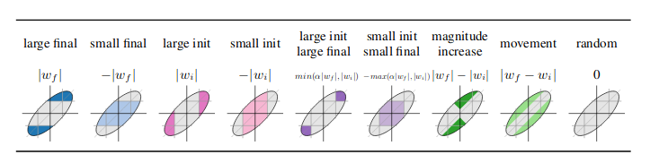

# Zeros, signs and the supermask
[Link to paper](https://arxiv.org/pdf/1905.01067.pdf)

Authors perform ablation study on the main components of the LT algorithm, specifically on:

- **mask criteria**: Which weights/when to prune
- **mask-1 actions**: What to do with remaining weights
- **mask-0 actions**: How to prune

Also they discover the existence of Supermasks (masks that produce above-chance results when applied to untrained networks)

### Mask criteria

Looked at metrics that compare initial wieght W_i with final weight W_f.

Best ones are in order:

- Large final (original magnitude-based from frankle)
- magnitude_increase (those that increase)
- large_init_large_final (those that remain large)
- movement (those that changed)

### mask-1 actions

authors experiment with different types of initializations for the kept weights:

- re-init: original frankle
- reshuffle: shuffle weights around.. 
- constant: set to a constant

**None work -> use original LTH**

### mask-0 actions

Authors try to set pruned weights to initial random value instead of 0. 
Turns out this does not work, except for at high levels of sparsity. 

**The mask criterion used tends to mask to zero the weights that were headed to 0 anyway.**

> To test this hypothesis, authors propose a halfway experiment: freeze pruned weights to 0 if they head towards 0, or to initial value if it moves away from 0. (Variant 1) By doing this they achieve similar performance as original LT network at low pruning rates, and better at higher pruning rates. Authors also use this idea as a mask-1 action i.e. they use it for the kept weights too (Variant 2), achieving even better results than the first variant. Thus, masking can be viewed as training.

---

## Supermask

##### motivation

*"The masking operation tends to move weights in the direction they would have moved during training. So what if we don't train at all?"*

##### What is a supermask?

A supermask is a mask that applied to a randomly initialized untrained network produces results better than chance. They use the same large magnitude pruning, but then a version that also prunes weights that did not maintain their initial sign.

So they do train the unpruned network, just not after pruning and get good performance.

Converting weights to signed constants also worked remarkably.

##### Supermasks can also be trained:

Instead of training the network, train a binary (bernoulli over a sigmoid) mask tensor over the weights.

- 95% on MNIST 
- 65% on CIFAR10. 

There is no straightforward way of controlling the amount of pruning, only by slight modifications of the initialization of the mask parameters.

Also, dynamic weight rescaling helps. Learned supermasks result in performance close to training the full network -> therefore a network already contains powerful subnetworks at initialization, that work well without training.

# REVIEW LATER

- No new Mask-1 actions
- Networks work well when mask-1 weights are set close to their final value
- Alternative freezing schemes and mask-0 criteria have been introduced
- The element of the original initialization that is most crucial is the sign, not relative magnitude of the weights; 
- Masking can be thought of as training, therefore authors uncover the existence of supermasks which produce partially working networks without training.
- We can also train masks

